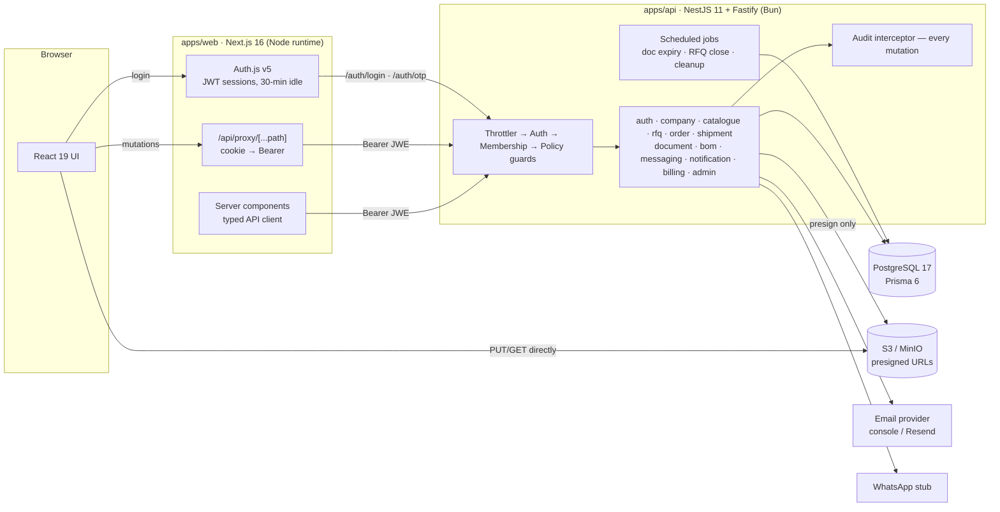

# PharmaChain

B2B pharmaceutical supply-chain platform — Phase 1 MVP.

Verified companies (raw-material manufacturers, finished-product manufacturers,
suppliers) publish catalogues, raise RFQs, exchange quotations, confirm orders,
track shipment progress, share trade documents and message each other — with
platform-admin verification, tiering, announcements, parameters and a full
audit trail underneath.

## Stack

| Layer | Technology |
| --- | --- |
| Monorepo | Turborepo 2 + Bun 1.3 workspaces, Biome (lint/format), `bun test` |
| Web | Next.js 16 (App Router, RSC), React 19, Tailwind 4, shadcn/ui, TanStack Query, react-hook-form + Zod |
| API | NestJS 11 on Fastify, executed by Bun (`bun src/main.ts`) |
| Auth | Auth.js v5 (JWT strategy, 30-min rolling sessions), credentials + email-OTP; argon2id via `Bun.password` |
| Data | PostgreSQL 17 + Prisma 6 |
| Storage | S3-compatible object storage (MinIO in dev), presigned PUT/GET via aws4fetch |
| Contracts | Zod v4 schemas shared from `@pharmachain/core`; Prisma types shared type-only |
| Jobs | `@nestjs/schedule` (in-process) or standalone worker (`bun run jobs`) |

## Repository layout

```
apps/
  api/            NestJS 11 + Fastify API (Bun runtime) — all business logic
  web/            Next.js 16 app — zero direct DB access, talks to the API only
packages/
  core/           Shared Zod contracts, enums, RBAC matrix, state machines
  db/             Prisma schema (26 models), client singleton, seed
  auth/           Auth.js config factory + server-side JWT decode helper
  email/          Email providers (console for dev, Resend) + templates
  notifications/  Event fanout: in-app + email (preference-aware) + WhatsApp stub
  ui/             shadcn/ui components, Tailwind 4 theme (dark mode)
  typescript-config/
e2e/              Playwright placeholder (golden-path scenario)
docs/             Implementation plan + US-xxx traceability
```

## Quick start

Prerequisites: [Bun](https://bun.sh) ≥ 1.3, Docker + Compose.

```bash
cp .env.example .env          # then set AUTH_SECRET (openssl rand -base64 32)
docker compose up -d          # PostgreSQL 17 + MinIO (+ bucket bootstrap)
bun install
bun run db:generate           # prisma generate
bun run db:push               # dev-only schema sync (prod applies the committed migrations)
bun run db:seed               # super admin, parameters, categories, FX, demo data
bun run dev                   # web http://localhost:3000 · api http://localhost:3001
```

The seed creates a platform super admin from `SEED_SUPER_ADMIN_EMAIL` /
`SEED_SUPER_ADMIN_PASSWORD` (see `.env.example` — dev placeholders, change them
anywhere shared) plus two verified demo companies with listings and an open RFQ.

### Commands

| Command | What it does |
| --- | --- |
| `bun run dev` | All apps in watch mode (turbo) |
| `bun run build` | Full build — runs `prisma generate` first via task graph |
| `bun run lint` / `lint:fix` | Biome check (format + lint) |
| `bun run typecheck` | `tsc --noEmit` in every workspace |
| `bun run test` | `bun test` suites (API unit tests: RBAC, state machines, limits…) |
| `bun run db:push` / `db:seed` / `db:studio` | Prisma dev workflows |
| `bun run db:migrate` | `prisma migrate dev` — evolve the committed migration set |
| `bun run db:migrate:deploy` | `prisma migrate deploy` — apply migrations (release pipeline) |
| `bun run --filter @pharmachain/api jobs` | Scheduled jobs as a standalone worker (`JOBS_IN_PROCESS=false`) |

## Architecture



Key properties:

- **Single source of truth for logic** — the web app has no database access.
  Server components call the API with the session JWE as a Bearer token; the
  browser goes through `/api/proxy/[...path]`, which swaps the session cookie
  for the same Bearer token and turns API 401s into a sign-out.
- **End-to-end types** — request bodies validate against `@pharmachain/core`
  Zod schemas on both sides; responses are typed in the web app via type-only
  Prisma imports mapped through `Jsonify<T>` (Date → ISO string, Decimal →
  string).
- **RBAC + tenancy** — every API route passes the guard chain (authentication,
  active membership with company scoping, role/permission policy). Super-admin
  access to order documents is itself audited.
- **Session security** — 30-minute rolling JWT; an idle warning fires at 25
  minutes, then sign-out. Deactivating a user bumps `sessionVersion`, which
  invalidates every outstanding token immediately. Sign-in is protected two
  ways: per-client-IP throttling (the web tier forwards the caller's IP) and
  a DB-backed per-account lockout (5 consecutive failures in 15 minutes →
  429), which rotating IPs cannot bypass.
- **Multi-instance safe** — scheduled jobs take a Postgres advisory lock
  (`pg_try_advisory_xact_lock`), so replicas and the standalone worker never
  double-run a sweep or double-send its notifications.
- **Side-effect discipline** — `notify()` never throws into a committed
  mutation; provider calls carry 10s timeouts; the audit row is written (with
  one retry) before the response is acknowledged.
- **Files** — clients never touch storage credentials: the API issues presigned
  PUT/GET URLs for random UUID keys; uploads pass a virus-scan stub before the
  document becomes downloadable; re-uploads create new versions and retain the
  old ones.

## Testing

- `bun run test` — API unit suites (RBAC matrix, RFQ/order state machines,
  freemium limit maths, quotation supersede, token/OTP hashing, thread email
  throttle).
- `e2e/` holds the Playwright golden-path scenario as a placeholder; wiring it
  to CI is a Phase 2 task (see `e2e/README.md`).

## Deployment guide

Two supported topologies:

### A. Single Vercel deployment (monorepo, web + API together)

The whole product ships as **one Vercel project**: the Next.js app plus the
NestJS API as a single serverless function mounted at `/api/backend`. Server
code calls it same-origin — no separate API host.

- `apps/api/src/serverless.ts` is the function entry: it boots the same Nest
  app (shared `bootstrap.ts`) once per warm instance, strips the
  `/api/backend` mount prefix, and hands the request to Fastify.
- `apps/web/src/env.ts` resolves `API_URL` to the same deployment (explicit
  `API_URL` → the public production alias; falls back to `VERCEL_URL`, then
  local `:3001`). The API function and the web app **share `AUTH_SECRET`** so
  the API can verify the Auth.js session the web app issued.
- Passwords use `@node-rs/argon2` and hashing uses `node:crypto` (not Bun
  APIs), so the exact same code runs on Bun locally and on Vercel's Node
  runtime; the Prisma client is generated with a `rhel-openssl-3.0.x` engine
  for the Lambda environment.

Deploy from the repo root (`scripts/deploy-vercel.sh`): it builds the API
bundle, runs `vercel build` for the web app, assembles the API function into
`.vercel/output` with its native deps (Prisma engine, argon2 binary), routes
`/api/backend/*` to it, and runs `vercel deploy --prebuilt --prod`. Because
the API is merged via the Build Output API, use this script (or CI running
it) rather than Vercel's git-push builds. Required project env: `AUTH_SECRET`
(≥32 chars), `DATABASE_URL` (Neon **pooled** URL for serverless), `APP_URL`,
and non-default `S3_*` values.

### B. Split hosts (containerised API)

- **API** — `docker build -f apps/api/Dockerfile -t pharmachain-api .` (multi-
  stage Bun image; Prisma engines for `debian-openssl-3.0.x` are generated in
  the build stage). Run it anywhere that takes a container.
- **Web** — `next.config.ts` sets `output: "standalone"`; run `bun run build`
  and deploy `apps/web/.next/standalone` on Node ≥ 20. Set `API_URL` to the
  API's URL, plus `AUTH_SECRET`, `AUTH_URL`.

### Database migrations (production path)

The migration set is committed under `packages/db/prisma/migrations`:

- `…_init` — the full Phase 1 schema.
- `…_business_invariants` — partial unique indexes Prisma's DSL cannot
  express: at most one live (non-superseded) quotation per (RFQ, supplier)
  and one ACTIVE BOM per product. The application enforces these
  transactionally; the indexes turn any race into a 409 instead of a
  duplicate.

```bash
bun run db:migrate:deploy   # release pipeline, against prod
bun run db:migrate          # locally, to evolve the schema (creates new migrations)
```

Development keeps using `bun run db:push` for fast iteration; never point
`db push` at production.

Optional hardening after the first deploy — make the audit log append-only at
the database level (requires the app to connect as a non-owner role):

```sql
REVOKE UPDATE, DELETE ON "AuditLog" FROM pharmachain;
```

### TLS & network topology

Terminate TLS at a reverse proxy (Caddy, Traefik, nginx) in front of both
apps; redirect HTTP → HTTPS and enable HSTS. With HTTPS on, Auth.js switches
to the `__Secure-` cookie prefix automatically — the API accepts both cookie
salts, so no extra configuration is needed.

The API keys rate limits and the login audit on the end-client IP forwarded
by the web tier. That header is only honoured when the caller proves it is
the web tier via `x-proxy-secret` (the shared `AUTH_SECRET`); anyone else
falls back to the platform-derived address, so spoofing `x-client-ip` cannot
rotate rate-limit buckets even when the API is reachable directly. The
security-sensitive throttles (login, OTP, register, password reset) persist
their counters in Postgres (`ThrottleBucket`), so they hold across serverless
instances and restarts; the short-window default limiter is per-instance by
design.

### Health probes

- `GET /health` — liveness (process up; touches nothing).
- `GET /health/ready` — readiness (database answers; returns 503 otherwise).

The API handles SIGTERM gracefully: in-flight requests drain, then Prisma
disconnects — safe for rolling deploys.

### Backups (required by US-1002)

Automated by two GitHub Actions workflows — no manual cron required:

- **`db-backup.yml`** — daily 02:30 UTC: `pg_dump -Fc` from a `postgres:18`
  container, AES-256 encrypted (`BACKUP_PASSPHRASE` secret; the repo is
  public, artifacts must never hold plaintext), uploaded as a workflow
  artifact with **30-day retention** on GitHub's storage — separate
  infrastructure from Neon. Failure opens a GitHub issue.
- **`db-restore-drill.yml`** — monthly, 1st 03:30 UTC: downloads the latest
  dump, decrypts, restores into a scratch Postgres 18 service and fails
  unless the core tables come back with data. A backup that has never been
  restored is not a backup. Failure opens a GitHub issue.
- **Secrets**: `NEON_DATABASE_URL` (the **direct**, non-pooled connection
  string — pg_dump needs session semantics PgBouncer doesn't provide) and
  `BACKUP_PASSPHRASE` (also mirrored to a Vercel env var for custody; losing
  it makes every backup unreadable).
- **Restoring for real**: download the newest `db-backup-*` artifact, then
  `openssl enc -d -aes-256-cbc -pbkdf2 -iter 200000 -in pharmachain.dump.enc \
  -out pharmachain.dump -pass env:BACKUP_PASSPHRASE` and
  `pg_restore --no-owner --dbname "$TARGET_URL" pharmachain.dump`.
- **Object storage**: enable versioning + replication on the documents bucket
  (or mirror MinIO with `mc mirror` on the same schedule).

### Environment

All configuration is environment-driven (12-factor); `.env.example` documents
every variable. Generate `AUTH_SECRET` with `openssl rand -base64 32`. Set
`EMAIL_PROVIDER=resend` + `RESEND_API_KEY` for real email; `console` logs to
stdout for dev.

## Phase 1 design decisions

1. Single `Listing` model with a `kind` enum (raw material | finished product)
   instead of two tables — search, compare and BOMs are cross-kind.
2. Shipment tracking lives on `Order` (6-stage forward-only status +
   `OrderStatusEvent` history) — the stories define the stages as the order
   lifecycle, so there is no separate shipment table.
3. Freight forwarder is an informational contact on the order; seller staff
   update shipment status (forwarder accounts are Phase 2).
4. Auth.js v5 beta pinned exactly (`next-auth 5.0.0-beta.31`); session
   revocation via a `sessionVersion` claim.
5. OTP login ships over email; SMS/WhatsApp channels are pluggable stubs.
6. Virus scanning and "automated document checks" are pluggable stubs (the
   checks — presence/expiry/type — are real; the scanner interface is stubbed).
7. Multi-currency is display-only, converted through admin-managed rates.
8. Credit/tier billing is manual admin confirmation (US-907) — no payment
   gateway in Phase 1.
9. Bun is the package manager and API runtime; the web app runs on the Node
   runtime (Next.js standalone) for stability. NestJS injectables must use
   value imports (`import { XService }`), never `import type` — type-only
   imports are erased and their `design:paramtypes` metadata degrades to
   `Object`, which breaks DI at boot. Biome's `useImportType` rule is
   disabled for `apps/api/src` to keep this safe.
10. No email-verification gate on registration — US-101 asks for a
    confirmation email only.

See `docs/implementation-plan.md` for the module-by-module breakdown and the
US-xxx → code traceability table.
